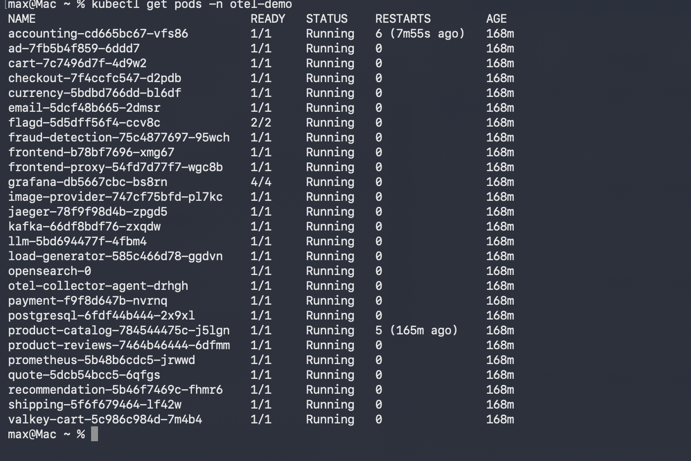
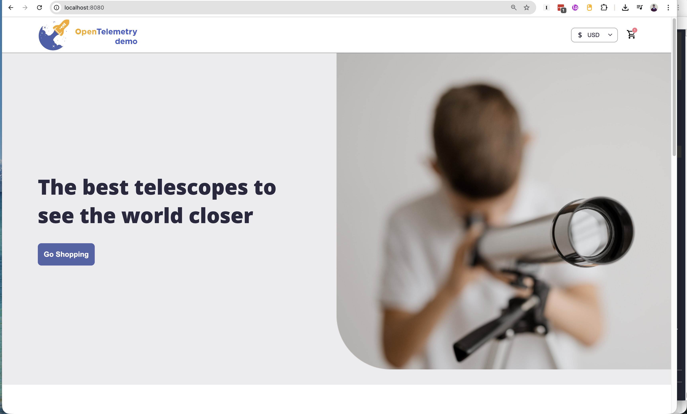
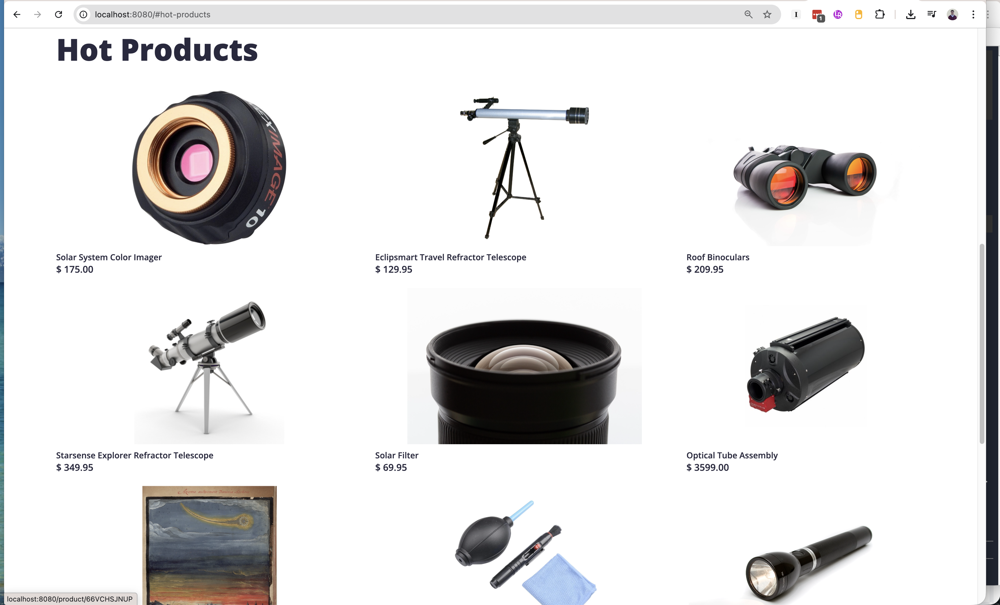
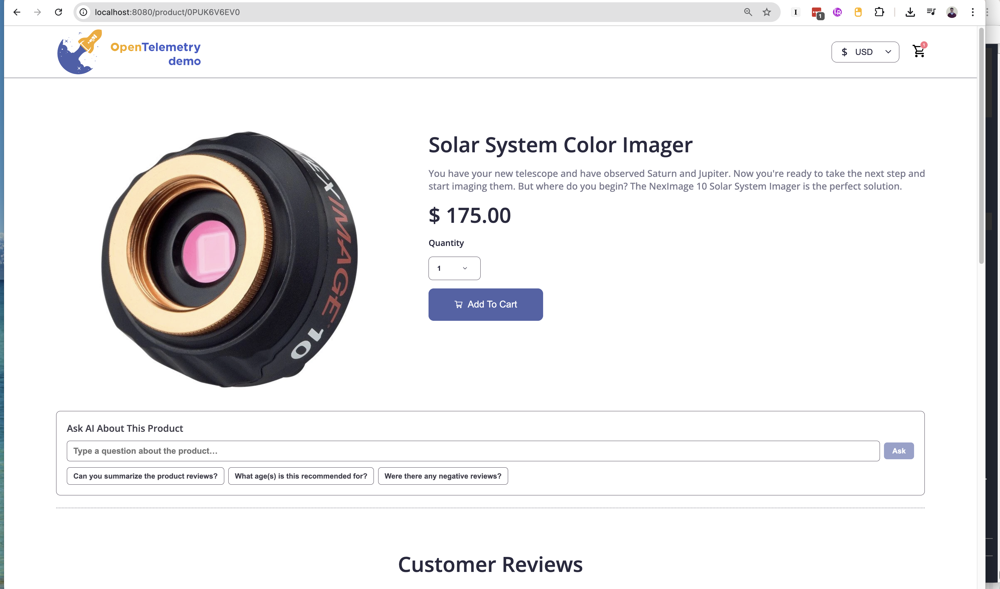
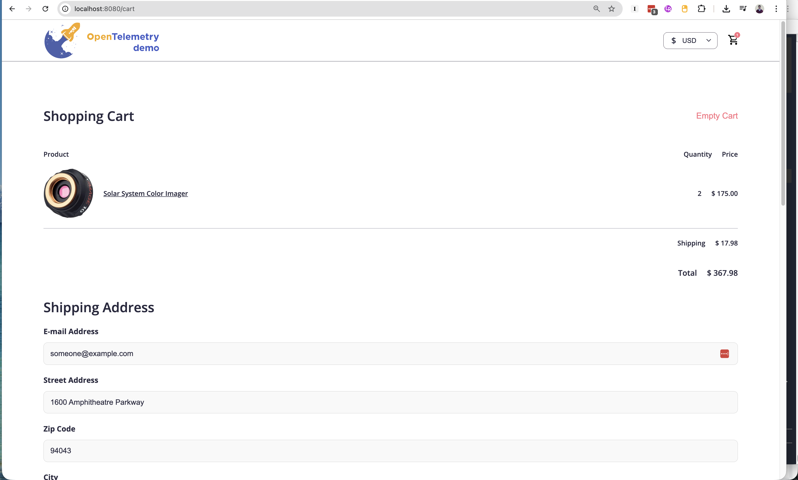
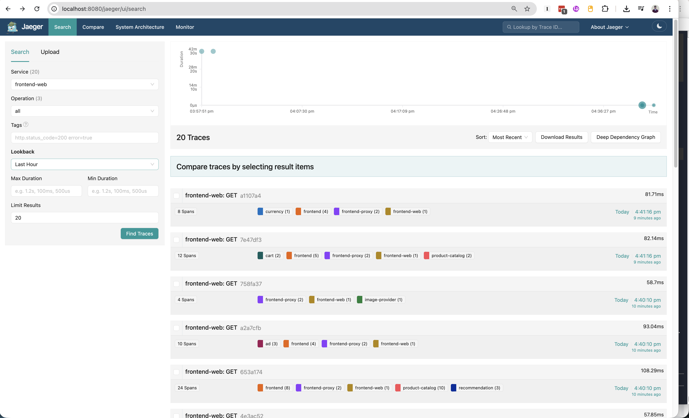
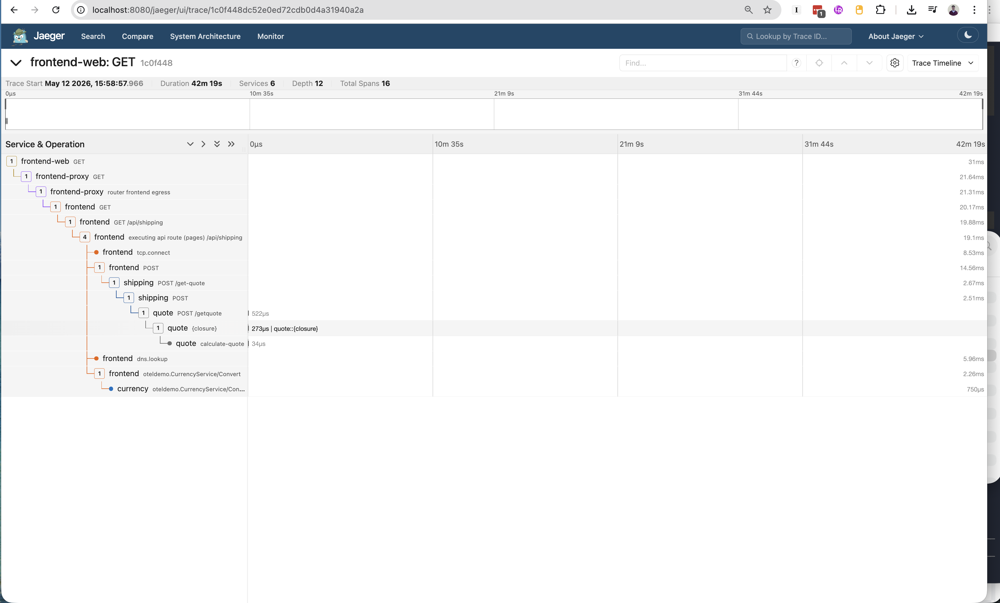
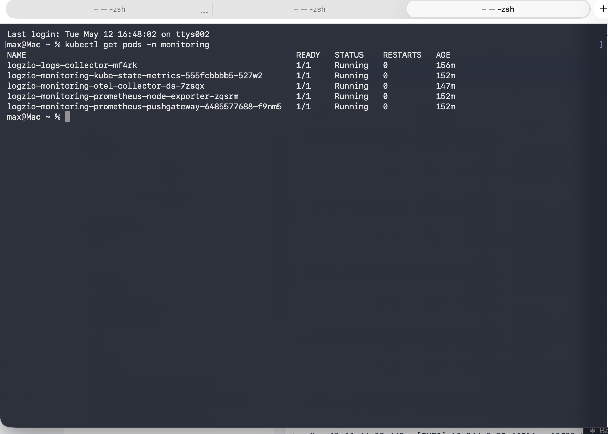
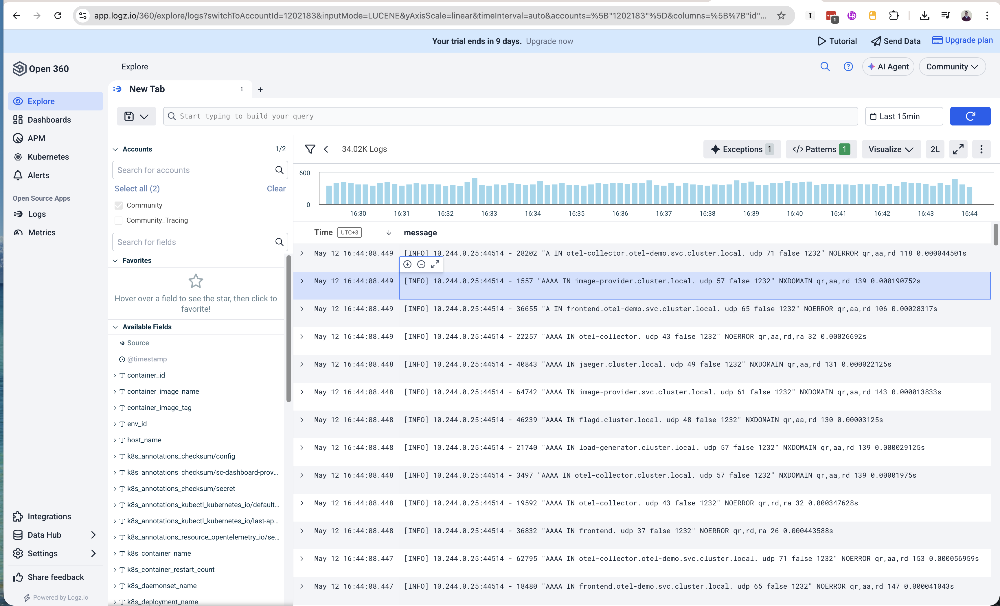
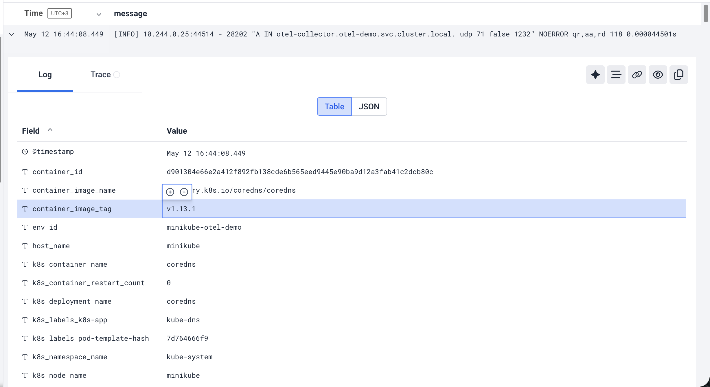

# Logz.io CSE Home Task
**Candidate:** Max Matkovski  
**Date:** May 12, 2026  
**Task:** Deploy OpenTelemetry Demo on Kubernetes and instrument it to send logs, metrics, and traces to logz.io

---

## Overview

This project covers the full deployment and instrumentation process for the logz.io CSE home task. The goal was to:

1. Deploy the OpenTelemetry Demo application on a local Kubernetes cluster (minikube)
2. Instrument the application to send **logs**, **metrics**, and **traces** to logz.io using the logz.io Kubernetes telemetry collector
3. Verify all three signal types are arriving in the logz.io platform

---

## Environment

| Component | Tool / Version |
|---|---|
| Machine | MacBook, Apple Silicon (arm64), macOS 26.3 |
| Container Runtime | Colima 0.10.1 (lightweight Docker VM for Mac) |
| Kubernetes | minikube v1.38.1 |
| Package Manager | Helm 4.1.4 |
| CLI | kubectl 1.36.0 |

---

## Step 1 — Install Prerequisites

Since the machine had no Kubernetes tooling installed, everything was set up from scratch using Homebrew.

**Installed:**
- `colima` — lightweight container runtime for Mac (replaces Docker Desktop)
- `docker` — Docker CLI
- `kubectl` — Kubernetes CLI
- `helm` — Kubernetes package manager
- `minikube` — local single-node Kubernetes cluster

```bash
brew install colima docker kubectl helm minikube
```

**Start the container runtime:**
```bash
colima start --cpu 4 --memory 8 --disk 60
```

---

## Step 2 — Start the Kubernetes Cluster

```bash
minikube start --driver=docker --cpus=4 --memory=7000 --disk-size=40g
```

minikube creates a single-node Kubernetes cluster inside the Colima VM. The `--driver=docker` flag uses the Docker socket provided by Colima.

**Verify:**
```bash
kubectl get nodes
# NAME       STATUS   ROLES           AGE   VERSION
# minikube   Ready    control-plane   1m    v1.35.1
```

---

## Step 3 — Deploy the OpenTelemetry Demo Application

The OpenTelemetry Demo is an open-source microservices e-commerce app (telescope store) purpose-built to demonstrate observability. Every service automatically emits logs, metrics, and traces. A built-in load generator continuously simulates real user traffic.

```bash
helm repo add open-telemetry https://open-telemetry.github.io/opentelemetry-helm-charts
helm repo update
kubectl create namespace otel-demo
helm install otel-demo open-telemetry/opentelemetry-demo --namespace otel-demo
```

### Microservices Deployed

| Service | Language | Role |
|---|---|---|
| **frontend** | TypeScript (Next.js) | Web UI — the telescope store |
| **frontend-proxy** | Envoy | Reverse proxy / API gateway for all services |
| **cart** | .NET | Shopping cart, backed by Valkey (Redis) |
| **checkout** | Go | Orchestrates the full order flow |
| **payment** | JavaScript (Node.js) | Processes payments (simulated) |
| **product-catalog** | Go | Product listings and search |
| **product-reviews** | Python | Customer reviews per product |
| **recommendation** | Python | ML-based product recommendations |
| **shipping** | Rust | Calculates shipping quotes and tracks deliveries |
| **quote** | PHP | Generates shipping cost quotes |
| **currency** | C++ | Currency conversion service |
| **email** | Ruby | Sends order confirmation emails (simulated) |
| **accounting** | Kotlin | Records financial transactions |
| **fraud-detection** | Kotlin | Scores orders for fraud risk |
| **ad** | Java | Serves contextual advertisements |
| **llm** | Python | LLM-powered product assistant |
| **image-provider** | nginx | Serves product images |
| **kafka** | Apache Kafka | Message bus between async services |
| **postgresql** | PostgreSQL | Database for product reviews |
| **valkey-cart** | Valkey (Redis fork) | In-memory store for shopping carts |
| **load-generator** | Python (Locust) | Continuously simulates user traffic |
| **otel-collector-agent** | OTel Collector | Internal telemetry routing between services |
| **flagd** | flagd | Feature flag service |
| **jaeger** | Jaeger | Internal distributed trace viewer |
| **grafana** | Grafana | Internal metrics dashboards |
| **prometheus** | Prometheus | Internal metrics scraper |
| **opensearch** | OpenSearch | Internal log storage for Jaeger |

> 

**Access the app:**
```bash
kubectl port-forward -n otel-demo svc/frontend-proxy 8080:8080
# Then open http://localhost:8080
```

> 

> 

> 

> 

**Other built-in UIs:**
- `http://localhost:8080/jaeger/ui/` — distributed traces
- `http://localhost:8080/grafana/` — internal metrics dashboards
- `http://localhost:8080/loadgen/` — load generator control panel

> 

> 

---

## Step 4 — Deploy the logz.io Telemetry Collector

```bash
helm repo add logzio-helm https://logzio.github.io/logzio-helm
helm repo update
kubectl create namespace monitoring
helm install logzio-monitoring logzio-helm/logzio-monitoring \
  --namespace monitoring \
  -f logzio-values.yaml
```

The `logzio-helm/logzio-monitoring` chart deploys three collection components:

| Component | What it collects | Destination |
|---|---|---|
| `logzio-logs-collector` | Container logs from all pods (filelog receiver) | logz.io Logs (OpenSearch) |
| `logzio-monitoring-otel-collector` | Kubernetes & node metrics (Prometheus scraping) | logz.io Metrics |
| `kube-state-metrics` | Kubernetes object state (deployments, pods, etc.) | scraped by above |
| `prometheus-node-exporter` | Node hardware metrics (CPU, memory, disk, network) | scraped by above |

See [`logzio-values.yaml`](logzio-values.yaml) for the full configuration.

> 

---

## Step 5 — Troubleshooting

### Issue 1: Port conflict — logs collector pod stuck in Pending

**Symptom:**
```
0/1 nodes are available: 1 node(s) didn't have free ports for the requested pod ports
```

**Root cause:** Both the OTel Demo's internal collector and the logz.io collector DaemonSet tried to bind to the same host ports on the single minikube node (`4317`, `4318`, `6831`, `14250`, `14268`, `9411`).

**Fix:** Set `hostPort: 0` for all receiver ports on the logz.io collector. The logz.io collector only needs to *collect* data — it doesn't need to receive data on host ports.

```yaml
logzio-logs-collector:
  ports:
    otlp:
      hostPort: 0
    otlp-http:
      hostPort: 0
    # ... all receiver ports set to 0
```

---

### Issue 2: Helm chart creates secrets with placeholder values → HTTP 401

**Symptom:**
```
error exporting items, request to https://otlp-listener.logz.io/v1/logs
responded with HTTP Status Code 401
```

**Root cause:** The `logzio-monitoring` Helm chart v7.x creates Kubernetes secrets on install but populates them with placeholders (`token`, `my_env`) instead of values from the Helm values file.

**Diagnosed by:**
```bash
kubectl get secret logzio-log-collector-secrets -n monitoring \
  -o jsonpath='{.data.logzio-logs-token}' | base64 -d
# Output: token  ← placeholder, not the real token
```

**Fix:** Patched secrets directly:
```bash
TOKEN=$(echo -n "<LOGS_TOKEN>" | base64)
kubectl patch secret logzio-log-collector-secrets -n monitoring \
  --type=json \
  -p '[{"op":"replace","path":"/data/logzio-logs-token","value":"'$TOKEN'"}]'

METRICS_TOKEN=$(echo -n "<METRICS_TOKEN>" | base64)
kubectl patch secret logzio-secret -n monitoring \
  --type=json \
  -p '[{"op":"replace","path":"/data/logzio-metrics-shipping-token","value":"'$METRICS_TOKEN'"}]'

kubectl rollout restart daemonset -n monitoring
```

---

## Step 6 — Verify Data in logz.io

### Logs

34,000+ log entries received within minutes. All pods across the `otel-demo` namespace are represented, with full Kubernetes metadata attached to every entry.

> 

> 

**How logs get to logz.io:**
```
OTel Demo microservices write to stdout
        ↓
Kubernetes saves as files: /var/log/containers/*.log
        ↓
logzio-logs-collector DaemonSet tails these files
        ↓
logz.io Logs (OpenSearch)
```

No code changes were needed in any application. Collection is purely infrastructure-level.

### Metrics

Node metrics (CPU, memory, disk, network) and Kubernetes workload metrics (pod status, deployment health, resource usage) are shipping via the `logzio-monitoring-otel-collector` DaemonSet.

### Traces

The OTel Demo generates distributed traces across all services. The Jaeger waterfall above shows a single cart page load spanning 6 services and 16 spans — frontend-web → frontend-proxy → frontend → shipping → quote → currency.

Traces are visible and confirmed working in the **internal Jaeger UI** at `http://localhost:8080/jaeger/ui/`.

The `logzio-apm-collector` was deployed and the OTel Demo's collector was configured to forward traces to it:

```yaml
logzio-apm-collector:
  enabled: true
  global:
    logzioTracesToken: "<TRACES_TOKEN>"
    logzioRegion: "us"
```

The OTel Demo's internal collector pipeline was extended to export to the APM collector alongside Jaeger:
```yaml
service:
  pipelines:
    traces:
      exporters: [otlp/jaeger, debug, spanmetrics, otlp/logzio]
```

**Status:** Traces confirmed in local Jaeger. Logz.io APM showing "Welcome" screen — next debugging step would be verifying the tracing token is mapped to the correct logz.io tracing sub-account and confirming the APM collector is receiving spans via `kubectl logs`.

---

## Architecture

```
┌─────────────────────────────────────────────────────┐
│                 minikube cluster                     │
│                                                     │
│  ┌───────────────────────────────────────────────┐  │
│  │            otel-demo namespace                │  │
│  │                                               │  │
│  │  frontend → cart → checkout → payment         │  │
│  │       ↕ kafka (async messaging) ↕             │  │
│  │  fraud-detection, accounting, shipping...     │  │
│  │                   ↓                           │  │
│  │       otel-collector-agent (internal)         │  │
│  └───────────────────────────────────────────────┘  │
│                      │                              │
│           (stdout → /var/log/containers/)           │
│                      ↓                              │
│  ┌───────────────────────────────────────────────┐  │
│  │           monitoring namespace                │  │
│  │  logzio-logs-collector (DaemonSet)           │  │
│  │  logzio-monitoring-otel-collector (DaemonSet)│  │
│  │  kube-state-metrics + node-exporter          │  │
│  └──────────────┬─────────────┬──────────────────┘  │
└─────────────────┼─────────────┼────────────────────┘
                  ↓             ↓
           logz.io Logs   logz.io Metrics
                  \             /
                   ↓           ↓
              logz.io Tracing (APM)
```

---

## Sources Used

- [OpenTelemetry Demo Helm Chart](https://open-telemetry.github.io/opentelemetry-helm-charts)
- [logz.io Kubernetes Telemetry Collector docs](https://docs.logz.io/user-guide/log-shipping/telemetry-collector-k8s.html)
- [logzio-helm GitHub](https://github.com/logzio/logzio-helm)
- [logz.io APM Collector chart values](https://github.com/logzio/logzio-helm/tree/master/charts/logzio-apm-collector)
- [minikube docs](https://minikube.sigs.k8s.io/docs/)
- [Colima — container runtime for macOS](https://github.com/abiosoft/colima)

---

## Repository Structure

```
.
├── README.md                # This document
├── logzio-values.yaml       # Helm values for logzio-monitoring chart
└── otel-demo-values.yaml    # Helm values for OTel Demo (trace forwarding config)
```

---

## Commands Reference

```bash
# Check application pods
kubectl get pods -n otel-demo

# Check monitoring pods
kubectl get pods -n monitoring

# View logs collector logs
kubectl logs -n monitoring -l app.kubernetes.io/name=logzio-logs-collector

# View metrics collector logs
kubectl logs -n monitoring -l app=logzio-monitoring-otel-collector-ds

# Access the demo app
kubectl port-forward -n otel-demo svc/frontend-proxy 8080:8080

# URLs after port-forward
# http://localhost:8080           — telescope store
# http://localhost:8080/jaeger/ui — traces
# http://localhost:8080/grafana/  — dashboards
# http://localhost:8080/loadgen/  — load generator
```
